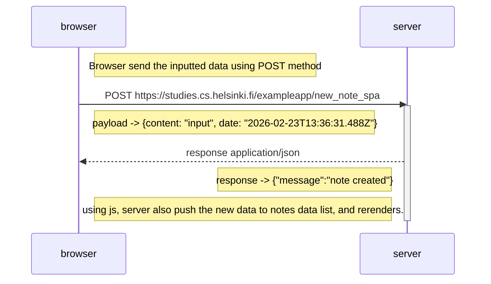

```mermaid
sequenceDiagram
    participant browser
    participant server
    
    Note right of browser: Browser send the inputted data using POST method
        browser->>server: POST https://studies.cs.helsinki.fi/exampleapp/new_note_spa
        activate server
        Note right of browser: payload -> {content: "input", date: "2026-02-23T13:36:31.488Z"}
        server-->>browser: response application/json
        Note left of server: response -> {"message":"note created"}
        Note left of server: using js, server also push the new data to notes data list, and rerenders.
        deactivate server
```